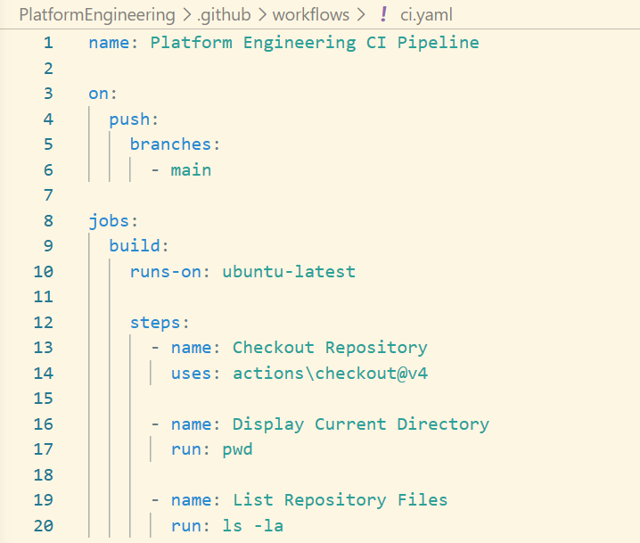
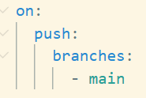
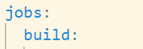
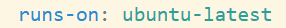
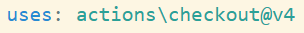
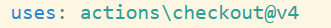

# 📚 Titan Lab 02 – GitHub Actions Fundamentals

# Objective

Understand the fundamental building blocks of GitHub Actions and how a Continuous Integration (CI) pipeline executes from the moment a developer pushes code until the GitHub Runner completes the workflow.

# Problem Statement

Modern software teams require an automated mechanism to validate, build, test and deploy code whenever changes are pushed to the source repository.

GitHub Actions provides an event-driven automation platform that enables Continuous Integration and Continuous Delivery (CI/CD).

# Why GitHub Actions?

GitHub Actions enables teams to:

* Automate software delivery
* Standardize CI/CD pipelines
* Improve deployment consistency
* Detect issues early
* Reduce manual effort
* Integrate security into the software delivery lifecycle

# Repository Structure

# Current Workflow

# Workflow Execution Flow

Developer

↓

git push origin main

↓

GitHub receives Push Event

↓

Workflow Trigger Matches

↓

GitHub creates Ubuntu Runner

↓

Repository Checkout

↓

Execute Workflow Steps

↓

Pipeline Completed

# Workflow

A Workflow is an automated process defined using YAML.

A workflow consists of:

* Events (Triggers)
* Jobs
* Steps

Each workflow executes independently.

# Trigger

This workflow executes whenever code is pushed to the main branch.

# Job

A Job is an independent unit of work executed inside a GitHub Runner.

Examples:
- Build
- Test
- Security Scan
- Infrastructure Provisioning
- Deployment

A workflow may contain one or more jobs.

# GitHub Runner

GitHub Runner is a temporary virtual machine created by GitHub to execute workflow jobs.

Characteristics:

* Ubuntu-based
* Fresh environment
* Ephemeral
* Automatically destroyed after workflow completion

# Steps

Steps are sequential tasks executed inside a Job.

Examples include:

* Checkout source code
* Execute shell commands
* Build applications
* Run tests
* Deploy infrastructure

# Uses

The uses keyword executes a reusable GitHub Action.

GitHub downloads the requested action and executes it inside the Runner.

Examples:

* actions/checkout
* azure/login
* docker/build-push-action

# run

run: terraform init

The run keyword executes shell commands directly inside the GitHub Runner.

Examples:

Bash
* pwd
* ls -la
* terraform init
* docker build.

# Checkout Action

Purpose:

Downloads the complete Git repository into the GitHub Runner.

Without Checkout:

* Repository is unavailable
* Terraform files cannot be located
* Dockerfile cannot be located
* Helm charts cannot be located

Most CI pipelines begin with the Checkout step.

# Runner Workspace

After Checkout, the Runner changes its working directory to the repository root.

Typical workspace:

/home/runner/work/<repository>/<repository>

Example:

/home/runner/work/project-titan-platform/project-titan-platform

# Linux Commands Used

* pwd - Displays the current working directory. Used to verify the Runner workspace

* ls - Lists files and directories present in the current working directory.

* ls -la - Displays Hidden files, File permissions, Owner, group, File size, Last modified timestamp. Useful for validating repository contents.

* whoami - Displays the Linux user executing the workflow. Userful for debugging permission-related issues.

# Environment Validation

A common validation sequence executed before build activities:

* pwd
* ls -la
* whoami

Purpose:

* Verify Runner location
* Verify repository checkout
* Verify executing user

This helps identify environment issues before running build or deployment tasks.

# Enterprise CI Pipeline Flow

Developer Push

↓

Repository Checkout

↓

Environment Validation

↓

Code Quality Validation

↓

Security Scanning

↓

Build

↓

Package

↓

Deploy

# Key Concepts

* Workflow - Complete CI/CD automation
* Trigger - Event that starts the workflow
* Job -	Independent execution unit
* Runner - Temporary virtual machine executing the job
* Step - Individual task executed inside a job
* uses - Executes reusable GitHub Actions
* run -	Executes shell commands
* Checkout - Downloads repository into Runner
* pwd -	Displays current working directory
* ls -la - Lists repository contents and hidden files
* whoami -	Displays the executing Linux user

# Key Takeaways

* GitHub Actions automates CI/CD workflows using event-driven triggers.
* Every workflow executes inside a fresh GitHub-hosted Runner.
* The repository is unavailable until actions/checkout executes.
* uses invokes reusable GitHub Actions, whereas run executes shell commands directly.
* pwd, ls -la, and whoami are fundamental commands used to validate the Runner environment.
* Environment validation is an important first stage in enterprise CI pipelines before build, test, or deployment begins.

