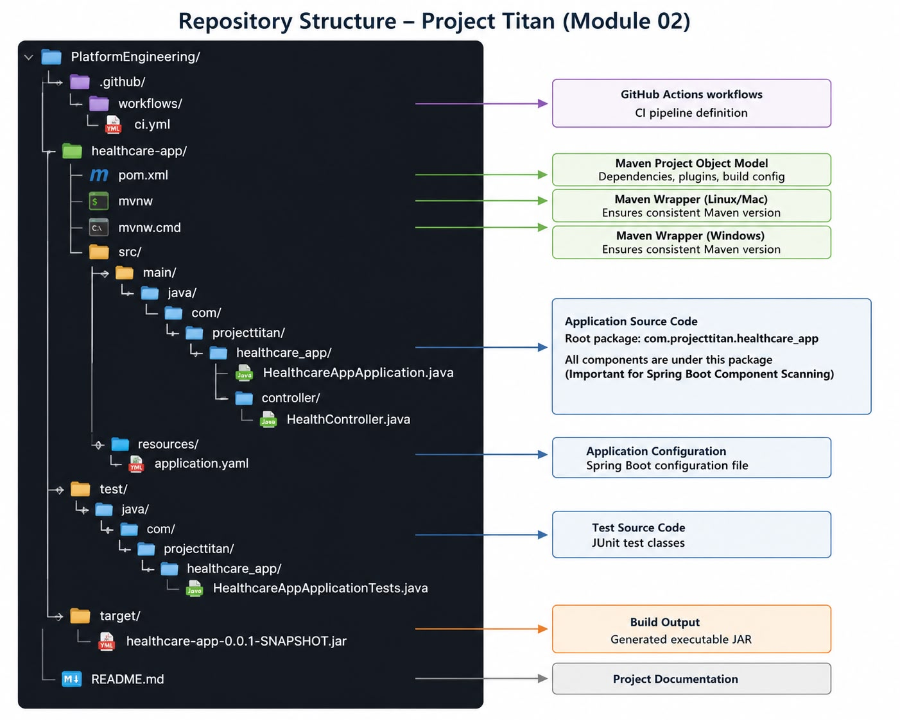
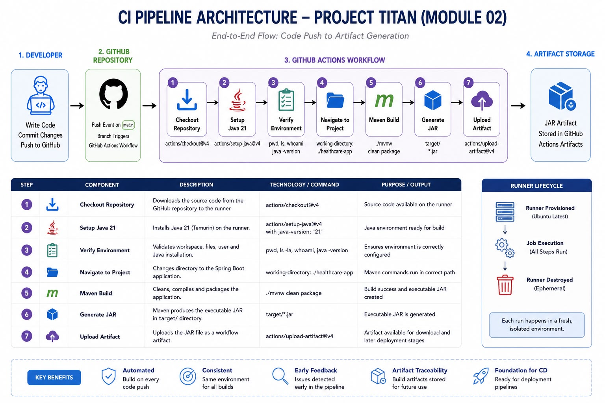
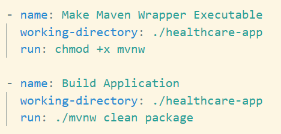
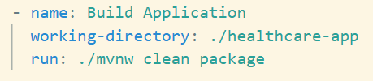
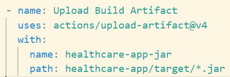
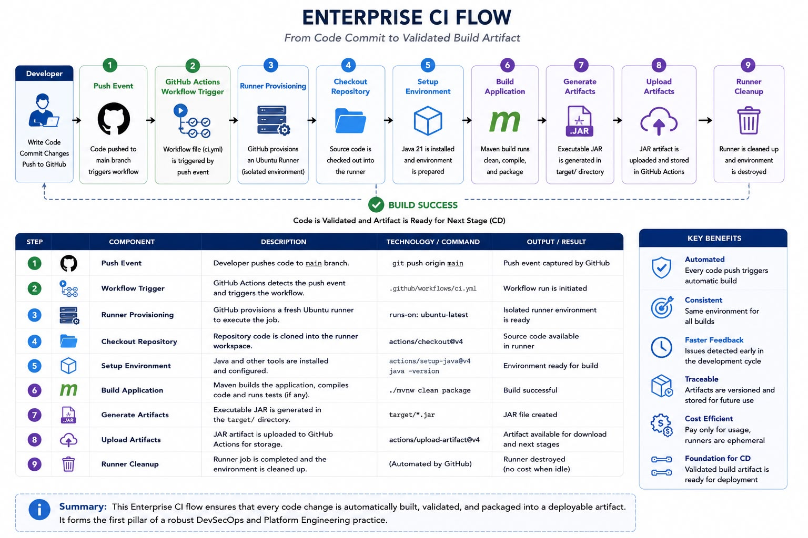

# 📚 Titan Lab 03 – Enterprise GitHub Actions CI Pipeline (Version1)

# Objective

Build an enterprise-grade Continuous Integration (CI) pipeline that automatically validates, builds, and packages a Spring Boot application whenever code is pushed to the GitHub repository.

This module establishes the foundation for all future DevSecOps, Platform Engineering, and Cloud deployment activities.

# Learning Outcomes

After completing this module, you can confidently explain and implement:

* GitHub Actions workflow architecture
* Event-driven CI pipelines
* GitHub-hosted Runners
* Maven Wrapper execution
* Spring Boot application build lifecycle
* Artifact generation and publishing
* Spring Boot component scanning
* Enterprise debugging methodology

# Repository Structure

# CI Pipeline Architecture

# Working Directory

# Purpose:

Changes execution context to the Spring Boot project directory before executing Maven commands.

Without this directive, the Runner cannot locate:

* pom.xml
* mvnw
* source code

# Maven Build

# Upload Artifact

# Purpose:

Publishes the generated JAR as a downloadable GitHub Actions artifact.

Benefits:

* Build validation
* Artifact retention
* Deployment input for later CD stages

# Enterprise CI Flow

# Best Practices

* Use Maven Wrapper (mvnw) instead of relying on installed Maven.
* Validate environment before building.
* Keep the @SpringBootApplication class at the root package.
* Use GitHub-hosted runners for CI.
* Upload artifacts for traceability.
* Fix the first compiler error before addressing subsequent errors.
* Treat pipeline failures as opportunities to debug systematically.

# Interview Questions

1. What is GitHub Actions?

GitHub Actions is an event-driven automation platform used to implement CI/CD workflows directly within GitHub repositories.

⸻

2. What is a Runner?

A GitHub Runner is a temporary virtual machine that executes workflow jobs.

⸻

3. Why is actions/checkout required?

Without checkout, the repository source code is unavailable to the Runner.

⸻

4. Difference between uses and run

uses executes reusable GitHub Actions.

run executes shell commands directly on the Runner.

⸻

5. Why use Maven Wrapper?

Ensures a consistent Maven version across developer machines and CI environments.

⸻

6. How does Spring Boot discover controllers?

Spring Boot performs component scanning beginning from the package containing the @SpringBootApplication class.

Controllers outside this hierarchy are not registered.

⸻

7. Why upload artifacts?

Artifacts preserve build outputs for:

* Deployment
* Verification
* Traceability
* Release management

⸻

Module Completion Checklist

* ✅ Created enterprise repository structure
* ✅ Generated Spring Boot application
* ✅ Implemented REST health endpoint
* ✅ Fixed Java syntax errors
* ✅ Understood Spring component scanning
* ✅ Built application locally
* ✅ Created GitHub Actions workflow
* ✅ Automated Maven build
* ✅ Uploaded JAR artifact
* ✅ Successfully executed Enterprise CI Pipeline V1

# What’s Next – Titan Lab 04

We will evolve the pipeline into a production-grade enterprise CI pipeline by adding:

Checkout
      ↓
Java Setup
      ↓
Maven Build
      ↓
JUnit Tests
      ↓
Code Coverage
      ↓
SonarQube
      ↓
SCA
      ↓
SAST
      ↓
Docker Build
      ↓
Container Scan
      ↓
Push to Azure Container Registry (ACR)