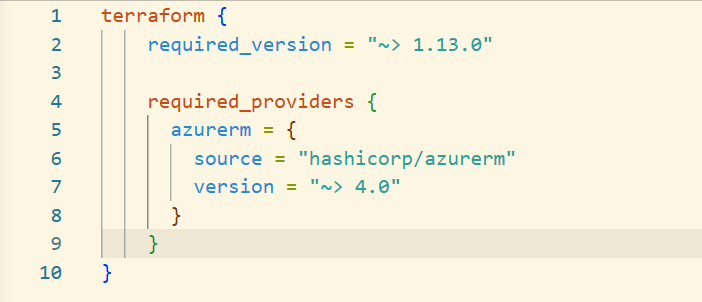
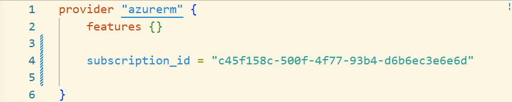
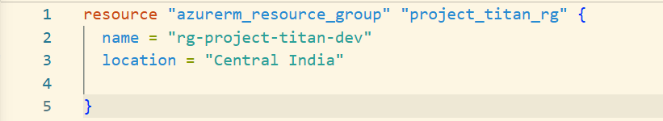
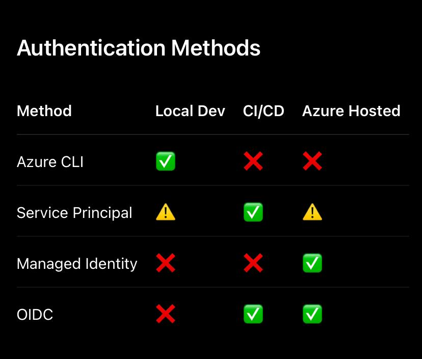

# 📚 Titan Lab 04 – Terraform Fundamentals & Azure Resource Group Provisioning

**Objective**

Provision the first Azure resource using Infrastructure as Code (Terraform) while understanding the internal working of the Terraform engine, AzureRM Provider, Azure Resource Manager (ARM), and Terraform state management.

⸻

**Architecture**

Developer

                     │

             Terraform CLI

                     │

      terraform init / plan / apply

                     │

             Terraform Engine

                     │

      Reads Terraform Configuration

      ├── versions.tf
      ├── providers.tf
      ├── main.tf
      └── terraform.tfstate

                     │

          AzureRM Provider Plugin

                     │

        Azure CLI Authentication

                     │

      Microsoft Entra ID (Azure AD)

                     │

         OAuth Access Token

                     │

     Azure Resource Manager (ARM)

                     │

        Azure REST APIs

                     │

          Azure Subscription

                     │

      Resource Group Provisioned

⸻

**Repository Structure**

terraform-platform/
│
├── versions.tf
├── providers.tf
├── main.tf
├── variables.tf
├── locals.tf
├── outputs.tf
├── README.md
├── .gitignore
└── .terraform/

⸻

**Files**

**Versions.tf**

 

Purpose

Configures the Terraform engine.

Defines:

* Compatible Terraform version
* Required providers
* Provider version constraints

**providers.tf**

Purpose

Configures Azure authentication and establishes communication between Terraform and Azure.

Authentication is obtained from the Azure CLI session created using:

**main.tf**

Purpose

Creates an Azure Resource Group.

**Terraform Lifecycle**

1. terraform init

Purpose

Initializes the Terraform working directory.

Internal flow:

terraform init

↓

Read versions.tf

↓

Identify Required Providers

↓

Terraform Registry

↓

Download AzureRM Provider

↓

Store Provider inside .terraform/

↓

Initialization Complete

Key Points

* Downloads provider plugins
* Creates .terraform/
* Does not communicate with Azure

⸻

2. terraform validate

Purpose

Validates Terraform syntax.

Checks:

* Configuration syntax
* Resource references
* Provider configuration

Does not provision infrastructure.

⸻

3. terraform plan

Purpose

Creates an execution plan.

Internal flow:

terraform plan

↓

Read Configuration

↓

Authenticate using Azure CLI

↓

AzureRM Provider

↓

Azure Resource Manager

↓

Read Existing Infrastructure

↓

Compare

Desired State

vs

Current State

↓

Execution Plan

Example:

Plan:

1 to add

0 to change

0 to destroy

Meaning:

* One new resource will be created.
* No resources modified.
* No resources destroyed.

⸻

4. terraform apply

Purpose

Applies the execution plan.

Internal flow:

Terraform Apply

↓

Read Execution Plan

↓

Authenticate to Azure

↓

AzureRM Provider

↓

Azure Resource Manager

↓

Azure REST API

↓

Create Resource Group

↓

Azure confirms success

↓

Update terraform.tfstate

⸻

**Terraform State**

Purpose

Terraform State stores the current state of the infrastructure.

Without it Terraform cannot determine:

* Existing resources
* Infrastructure changes
* Resource dependencies

⸻

Why Local State is Bad

If stored locally:

Developer A

↓

Creates Infrastructure

↓

State File

(Local Machine)

Developer B

↓

No State File

↓

Terraform assumes infrastructure doesn’t exist

↓

Duplicate Resources

↓

Infrastructure Drift

↓

Unexpected Cost

⸻

**Enterprise Solution**

Store the state remotely.

Azure Storage Account

↓

Blob Container

↓

terraform.tfstate

↓

State Locking

↓

Multiple Engineers

We'll implement this in the next lab.

**Why Azure CLI Authentication?**

Advantages:

* No hardcoded credentials
* Reuses OAuth token
* Easy local development
* Secure

Workflow:

az login

↓

Azure CLI

↓

Microsoft Entra ID

↓

OAuth Token

↓

Terraform

↓

AzureRM Provider

⸻

**Git Ignore**

.terraform/
*.tfstate
*.tfstate.*
crash.log
*.tfvars
*.tfvars.json
override.tf
override.tf.json

Note: We intentionally commit .terraform.lock.hcl in enterprise projects so every developer and CI/CD pipeline uses the exact same provider version.

⸻

**Key Interview Questions**

Why do we use required_version?

To ensure all developers and CI/CD pipelines use a compatible Terraform version, preventing breaking changes and ensuring consistent behavior.

⸻

Why is the provider downloaded only once?

Terraform caches the provider inside .terraform/. On subsequent runs it reuses the cached version unless the required version changes.

⸻

Why does terraform init not connect to Azure?

Its purpose is only to initialize the working directory and download providers. Azure communication begins during terraform plan and terraform apply.

⸻

Why is the Terraform State updated only after Azure confirms resource creation?

To ensure Terraform’s state accurately reflects the actual infrastructure. Updating the state before Azure confirms success could lead to state inconsistency and incorrect future plans.

⸻

Why is Azure CLI suitable for local development but not GitHub Actions?

Azure CLI authentication depends on an interactive user login and local access token. GitHub Actions runs on ephemeral remote runners with no access to your local session, so CI/CD pipelines use Service Principals or OIDC instead.

⸻

**Lab Outcome**

By completing this lab, you have successfully:

* ✅ Understood Terraform architecture
* ✅ Understood Terraform providers
* ✅ Understood AzureRM Provider
* ✅ Configured Azure CLI authentication
* ✅ Executed terraform init
* ✅ Executed terraform validate
* ✅ Executed terraform plan
* ✅ Provisioned the first Azure Resource Group using terraform apply
* ✅ Understood Terraform State
* ✅ Prepared the repository for enterprise Infrastructure as Code

🚀 Next Lab (Lab 4)

Enterprise Terraform Backend

We'll build:

Resource Group
      │
      ▼
Storage Account
      │
      ▼
Blob Container
      │
      ▼
Remote terraform.tfstate
      │
      ▼
State Locking
      │
      ▼
Multi-Engineer Collaboration

This is the next major step toward a production-grade Platform Engineering setup.