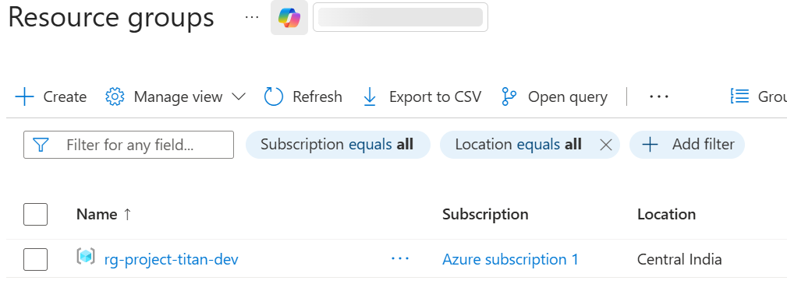
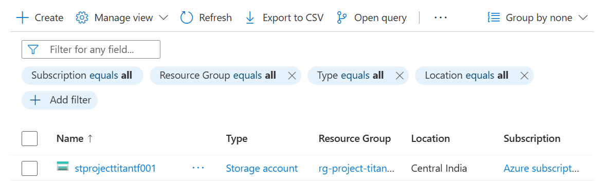
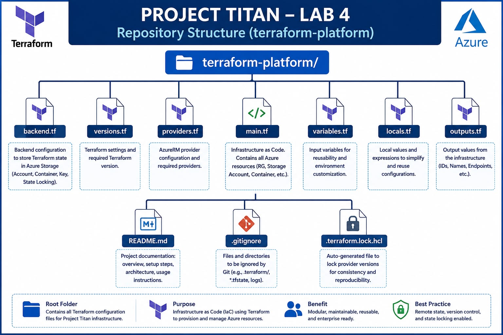
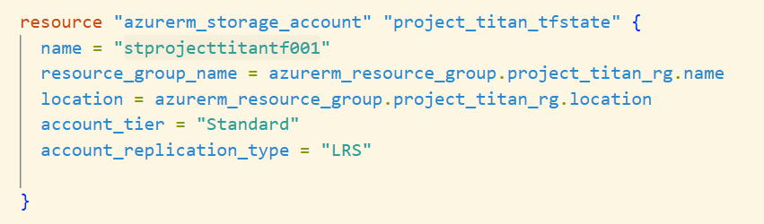
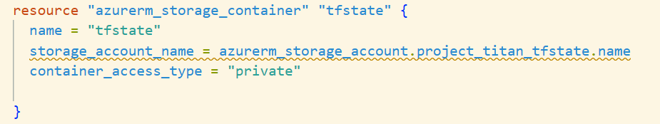
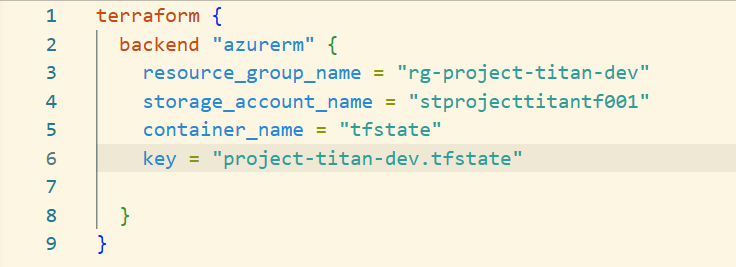

# 📘 Titan – Lab 4 - Enterprise Terraform Remote Backend

**Objective**

Configure an Enterprise Remote Terraform Backend using Azure Storage Account and Blob Storage to enable centralized state management, collaboration, state locking, and enterprise-grade Infrastructure as Code.

⸻

**Learning Objectives**

By the end of this lab, you will understand:

* Azure Storage Account
* Azure Blob Container
* Terraform Backend
* Local vs Remote State
* State Migration
* State Locking
* Backend Initialization
* Enterprise Terraform Architecture

**Enterprise Architecture**

                    Developer

                       │

                 Terraform CLI

                       │

                terraform init

                       │

               Backend Initialization

                       │

        Azure Storage Account (Standard)

                       │

               Blob Container (tfstate)

                       │

        project-titan-dev.tfstate

                       │

                Blob Lease Lock

                       │

           Azure Resource Manager

                       │

              Azure Resources

**Azure Resources Created**

* Resource Group

* Storage Account

Configuration
- Standard Performance Tier
- LRS Replication

Reason
 - Low cost
 - Suitable for Development
 - Stores only Terraform state
 - Three copies within one Azure datacenter

**Blob Container**
 - Name = tfstate
 - Access Level = Private

 Reason
 * Terraform State may contain
  - Resource IDs
  - Infrastructure Metadata
  - Sensitive Configuration

Therefore it should never be publicly accessible.

**Repository Structure**

**Storage Account Resource**

**Blob Container Resource**

**Backend Configuration**

What is Backend?

A Backend tells Terraform

* Where the State File is stored
* How Terraform should access it
* Whether State Locking is enabled

Without Backend Configuration

Developer Laptop

        ↓

terraform.tfstate

With Backend Configuration

Azure Storage Account

        ↓

Blob Container

        ↓

terraform.tfstate

**What is the Key?**

- The key is simply the blob name (or path) used to store the Terraform state file inside the Blob Container.

Example:

Storage Account

    ↓

Blob Container

    ↓

project-titan-dev.tfstate

It is a custom value chosen by the Platform Engineering team.

Enterprise Example:

- dev/platform/terraform.tfstate

- prod/platform/terraform.tfstate

- network/dev/network.tfstate

- aks/prod/cluster.tfstate

**Terraform State Migration**

* Command
terraform init -migrate-state

* Internal Flow

Read Local terraform.tfstate

        ↓

Connect Azure Storage

        ↓

Locate Blob Container

        ↓

Create Blob

        ↓

Upload State

        ↓

Configure Backend

        ↓

Future Operations Use Remote State

**Important Concept**

Terraform does NOT
- Recreate Resources
- Modify Infrastructure
- Destroy Infrastructure

It only changes "State Location" from Laptop to Azure Blob storage

**Backend Initialization Lifecycle**

* Terraform Startup

terraform init

↓

Read Backend Configuration

↓

Initialize Backend

↓

Download Remote State

↓

Download Providers

↓

Read Resources

↓

Build Dependency Graph

⸻

**Storage Account vs Blob Container**

Storage Account

Top-level Azure Storage Service.

Provides

* Blob Storage
* File Storage
* Queue Storage
* Table Storage

Responsible for

* Security
* Replication
* Performance
* Encryption
* Networking

⸻

**Blob Container**

Logical container inside Storage Account.

Stores

* Files
* Images
* Backups
* Terraform State

⸻

**State Locking**

* Without State Locking

Developer A

↓

terraform apply

↓

Updating State

Developer B

↓

terraform apply

↓

Updating State

↓

State Corruption

* With State Locking

Developer A

↓

Lock State

↓

Deploy

↓

Update State

↓

Unlock

Developer B

↓

Wait

↓

Wait

↓

Proceed

⸻

**Key Interview Questions**

What is Terraform Backend?

A backend defines where Terraform stores its state and how it accesses it.

⸻

What is State Migration?

Moving the existing local Terraform state to a configured remote backend without modifying the infrastructure.

⸻

What is the purpose of the key?

The key defines the blob name/path used to store the Terraform state file inside the Blob Container.

⸻

Why can’t Backend use Variables or Resource References?

Because the backend is initialized before Terraform loads resources, variables, providers, and the dependency graph. Backend configuration must therefore be static.

⸻

Why use Remote Backend?

* Centralized state
* Team collaboration
* State locking
* High availability
* Security
* Enterprise CI/CD support

⸻

Lab Outcome

Successfully completed:

* ✅ Azure Storage Account Provisioning
* ✅ Azure Blob Container Creation
* ✅ Backend Configuration
* ✅ Remote State Migration
* ✅ Enterprise Terraform Backend
* ✅ State Locking Foundation
* ✅ Enterprise State Management